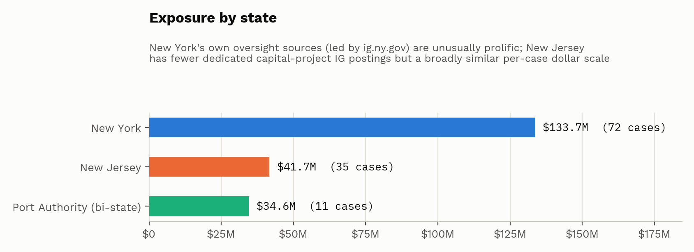
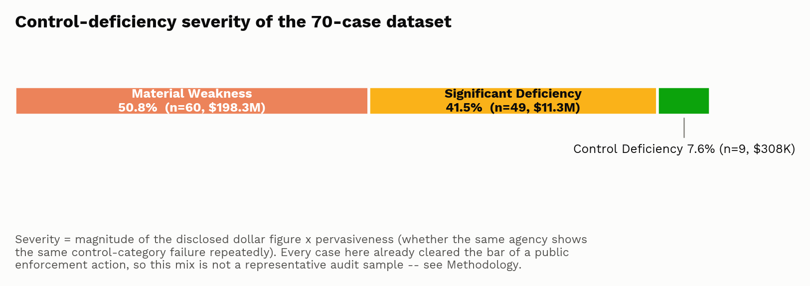
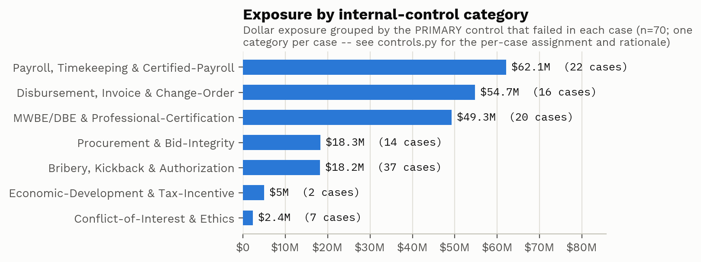
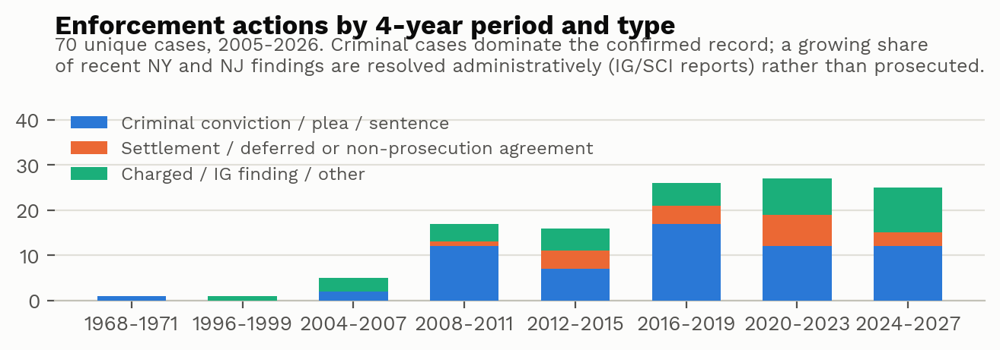

# NYNJ Capital Risk Data

**[Open the interactive tracker →](https://claude.ai/artifact/TQ6ngMFRFBG1Puq8QEEu4U)**

118 enforcement and litigation cases tied to capital construction projects in New York, New Jersey,
and the bi-state Port Authority of NY & NJ. Each case is sourced and checked individually, not
scraped in bulk. This project has three parts: the dataset itself, an internal-controls and
risk-tier analysis on top of it, and an interactive tracker to explore both.

| | |
|---|---|
| Cases tracked | 118 |
| Tracked financial exposure | $210.0M |
| Agencies represented | 39 |
| Regions covered | 10 |
| Sample period | 1971 – 2026 |

---

## Sources

New York cases come from the NYS Office of the Inspector General, the NYS Comptroller, the MTA
Inspector General, the NYC Department of Investigation, NYC-area county District Attorneys, the NY
Department of Labor, and the NY Attorney General. New Jersey and bi-state cases come from the NJ
Attorney General, the NJ Comptroller, the NJ State Commission of Investigation, NJ county
prosecutors, the NJ Division of Criminal Justice, the NJ Economic Development Authority, and the
Port Authority's own Inspector General. Across both states, the project also draws on the federal
DOT Office of Inspector General, the NYC Comptroller's audit office, and SEC enforcement actions.

Every case is checked against a second, independent source before being marked confirmed,
probable, or uncorroborated.

This is a standalone project: no data, code, or branding shared with any other project in this
account. It's meant to be read alongside the federal-level Infrastructure Risk Diligence project,
but doesn't depend on it — cases already captured there are excluded here.

## Headline result

| Metric | Value |
|---|---|
| Raw press releases / IG findings collected | 126 |
| Unique cases after deduplication | 118 |
| Duplicate (later-stage restatement) rate | 6.3% |
| Independently confirmed | 74.6% (88 of 118) |
| Probable (partial corroboration) | 6.8% (8 of 118) |
| Uncorroborated | 18.6% (22 of 118) |
| Contract value, fraud proceeds, or realized losses implicated | $210.0M |
| Regions across NY & NJ represented | 10 |
| Distinct agencies / authorities represented | 39 |
| Sample period | 1971 – 2026 |
| Largest project-type exposure | School Construction ($86.4M across 22 cases, both states) |
| Largest categories by primary control category (exclusive, one per case) | Bribery, Kickback & Authorization (31.4% of cases), MWBE/DBE & Professional-Certification (16.9%) |

### By state

| State / bucket | Cases | Confirmed | Dollar exposure |
|---|---|---|---|
| New York | 72 | 52 (72.2%) | $133.7M |
| New Jersey | 35 | 25 (71.4%) | $41.7M |
| Port Authority of NY & NJ (bi-state) | 11 | 11 (100%) | $34.6M |

The 11 Port Authority cases are kept in their own bucket rather than assigned to either state,
since its capital programs and enforcement record (its own OIG, plus federal partners in both
states) don't belong to one state's oversight more than the other's.

## Charts

A few of the charts `charts.py` builds from the dataset (the full set, plus four exploratory
charts, lives in `charts/`):






## Controls and risk

| Metric | Value |
|---|---|
| Largest control category by dollar exposure | Payroll, Timekeeping & Certified-Payroll ($62.1M, 22 cases) |
| Most numerous control category | Bribery, Kickback & Authorization (37 cases, $18.2M) |
| Material Weakness-equivalent cases | 50.8% of cases (60 of 118) — 94.5% of dollar exposure |
| Significant Deficiency-equivalent cases | 41.5% of cases (49 of 118) — 5.4% of dollar exposure |
| Control Deficiency-equivalent cases | 7.6% of cases (9 of 118) — 0.1% of dollar exposure |
| Pervasive (agency × control-category) findings | 12 — led by NYCHA (Bribery, 8 cases) and NJ Municipal Redevelopment (Bribery, 7 cases); MTA and the Port Authority each with 6 cases in their own gap; DASNY and NJ SCC/SDA with 5 apiece; plus NYC SCA (Payroll, 4 cases) and NYPA / NYC DOE / the Port Authority again / NJDOT / NYSDOT (3 cases apiece) |
| Exposure variance, 2016–2019 → 2020–2023 | -$10.7M (-18.0%), driven mainly by Payroll (-$36.2M, the $36M SCA/Nadeem scheme rolling off) partly offset by Disbursement (+$28.4M, a 2021 NJ SCI finding on underpriced SDA property sales) |
| Risk-tier pairings (`risk_index.py`) | 8 Elevated Focus, 14 Recurring Pattern, 42 Isolated Precedent (64 agency × control-category pairings total) |

Every case is assigned one primary control category — see `controls.py` for the full rubric. A
seventh category, Economic-Development & Tax-Incentive Controls, covers two New Jersey cases (the
Holtec/Singh tax-credit settlement and the dismissed Norcross indictment) that don't fit the other
six, construction-focused categories. Because every case here already cleared the bar of a
substantiated enforcement action, the severity mix leans toward higher severity — it isn't a
representative sample of a normal control environment.

The risk-tier indicator ("Elevated Focus" / "Recurring Pattern" / "Isolated Precedent") is a fixed,
disclosed rule — pervasiveness, whether the pairing includes a Material Weakness case, and recency
— not a machine-learning model. It shows where scrutiny has concentrated historically, not a
forecast of future fraud. Both layers appear case-by-case and in aggregate in the tracker.

## Files

- `build_dataset.py` — the dataset itself: 126 case records, each checked against a second source
  and classified confirmed, probable, or uncorroborated. Every record has a `state` field (`NY`,
  `NJ`, or `NY/NJ` for the bi-state Port Authority). Writes `data/raw_cases.csv`.
- `analyze.py` — deduplicates and verifies the records, groups region and agency names into a
  small set for charting, and computes the summary statistics used throughout. Writes the
  `data/*.json` files.
- `controls.py` — assigns one control category and a severity rating to every case, by reading
  each one individually rather than matching keywords. Writes `data/cases_with_controls.json`,
  `data/controls_by_category.json`, and `data/severity_summary.json`.
- `variance_analysis.py` — a period-over-period summary, plus a waterfall breakdown of the
  dollar-exposure change between the two most complete periods, by control category. Writes
  `data/variance_by_period.json` and `data/variance_drivers.json`.
- `charts.py` — builds 8 charts: verification status, exposure by type/region/state, a timeline,
  exposure by control category, severity distribution, and the variance waterfall. Writes to
  `charts/`.
- `exploratory_charts.py` — four extra charts outside the main pipeline: volume by period,
  cumulative exposure, a risk matrix, and repeat entities. Writes to `charts/exploratory/`.
- `fonts/` — Work Sans and IBM Plex Mono, bundled so the charts render the same regardless of
  what's installed on your machine.
- `data/raw_cases.csv` — the full 126-record dataset, including every source link, dollar-amount
  basis, and verification note. This is the primary source behind every number above.

## How the tracker works

The tracker ("NYNJ Capital Risk Data") is built by three more scripts that run after the ones
above. They precompute everything the tracker shows, so the page itself never calls a model —
visiting it doesn't use anyone's Claude usage.

- `data/ai_typology.json` — a fraud-mechanism category for each case (one of 8, such as
  Bid-Rigging or Bribery/Kickback), a few case-specific red flags, a verification-gap note, and a
  confidence rating. Assigned by reading each case's summary, not by matching keywords. This is a
  classification for review, not a verified finding.
- `risk_index.py` — reads `data/cases_with_controls.json` and `data/ai_typology.json` and computes
  the risk tier above for every agency/control-category pairing. Writes `data/risk_index.json` and
  `data/state_summaries.json`.
- `state_narratives.py` — reads the two files above and writes the "what this means for New York,"
  "New Jersey," and Port Authority sections, built entirely from computed values. Writes
  `data/state_narratives.json`.
- `build_tracker.py` — assembles all of the above, plus the case register, filters, map, and
  charts, into `capital_risk_tracker.html`, published via the Artifact tool.

## Hosting

This repository is the project's public landing page — read the stats, framing, and links above
directly on GitHub. The tracker itself is currently published via Claude's Artifact tool.
`capital_risk_tracker.html` in this repo is the same file and has no external dependencies, so it
can also be served directly from this repo via GitHub Pages if a fully GitHub-hosted version is
preferred.

## Reproduce from scratch

```bash
pip install -r requirements.txt

python3 build_dataset.py       # -> data/raw_cases.csv
python3 analyze.py             # -> data/summary.json, data/index_by_*.json, data/cases_unique.json
python3 controls.py            # -> data/cases_with_controls.json, controls_by_category.json, severity_summary.json
python3 variance_analysis.py   # -> data/variance_by_period.json, data/variance_drivers.json
python3 charts.py              # -> charts/*.png (8 exhibits)

# Tracker (after the above; see "How the tracker works" above)
python3 risk_index.py          # -> data/risk_index.json, data/state_summaries.json
python3 state_narratives.py    # -> data/state_narratives.json
python3 build_tracker.py       # -> capital_risk_tracker.html (published via the Artifact tool)
```

Each script is standalone and prints its own results to stdout, so you can run and check one
stage at a time instead of trusting a black-box pipeline.

## Notes on methodology

- **One combined dataset, not two separate studies.** When New Jersey was added, every existing
  New York case kept its original record (backfilled with `state="NY"`), and the New Jersey and
  bi-state cases were added as a separate, clearly marked block in `build_dataset.py`. Every script
  after that — `analyze.py`, `controls.py`, `variance_analysis.py`, `charts.py` — runs over all the
  cases together, so every count and chart reflects both states.
- **Two different things, told apart.** Agencies in both states often republish the same action at
  each procedural stage (charged, then pleaded guilty, then sentenced), so those collapse into one
  case. But some cases involve different co-defendants charged separately for the same underlying
  scheme (the MTA's Ahern/Tower/Spectrum trio; NYPA's Over Rock Construction scheme) — those stay
  as separate cases, since each is its own accountability event, but their shared dollar figure is
  counted once, not once per defendant. The hardest single call is Buffalo Billion/SUNY
  Polytechnic: convicted in 2018, vacated by the Supreme Court in 2023 (*Ciminelli v. United
  States*), and resolved by new guilty pleas in 2026. All three stages stay in the dataset as
  separate records, but only the 2026 outcome — the one that actually stuck — counts toward the
  total.
- **Dismissed and vacated cases are disclosed, not dropped.** A dismissed NYC DEP case is kept at
  $0 rather than deleted. The same applies to New Jersey's highest-profile negative outcome: the
  2024 racketeering indictment against George Norcross and five co-defendants, dismissed by a
  Superior Court judge and the appeal rejected, stays in the dataset with its dollar figure zeroed
  out. A dataset that only records convictions would hide how often a case like this doesn't end
  that way.
- **Dollar figures are fraud-specific or realized amounts, not contract value or unproven audit
  flags.** A Port Authority case where someone was paid $2M to front as a minority participant on
  a $586M contract is counted at $2M, not $586M. A $67M NJ Schools Construction Corporation
  finding of "questionable and duplicative payments" is disclosed but excluded from the total,
  since it's a governance red flag, not an adjudicated loss — the same treatment as a similar NJ
  patronage-hiring report. A $27.5M finding on NJ Schools Development Authority properties sold
  below market value is counted, since that's a realized loss.
- **Region and agency names are simplified only for charts.** The dataset keeps specific,
  citation-friendly language (e.g. "Capital Region (Albany/Schenectady/Latham)"). `analyze.py`
  groups these into a smaller set — 10 regions, 39 agencies — for indexing and charts, while the
  original strings stay in the CSV.
- **Every case was checked for a second source, not assumed.** Cases that stayed uncorroborated
  after a documented search are kept, not dropped. A cluster of DASNY MWBE findings and New
  Jersey's own oversight-commission reports — both substantiated by an inspector general but not
  prosecuted — make up most of this group in each state.
- **Hand-coded, not scraped.** Every record was read individually and coded by hand (state,
  region, agency, project type, entities, dollar figure, violation type, stage, source), so every
  classification is traceable to a specific person reading a specific page.
- **Control categories are assigned by reading each case, not by keyword.** This matters most for
  multi-stage cases whose final record only describes the procedural outcome — Buffalo Billion's
  2026 record covers the Supreme Court vacatur and new pleas, not the original bid-rigging scheme.
  Matching on that record alone would misclassify it.
- **Severity is mechanical, not subjective.** Magnitude (the case's dollar figure) and
  pervasiveness (how many other cases share the same agency and control category) are both
  computable from fields already in the dataset, so `controls.py` derives severity from a fixed
  rule. The only judgment calls are the rubric's thresholds and the one-time control-category
  assignment above.
- **The variance waterfall is drawn directly in matplotlib, not a generic bar chart**, since it
  needs signed, per-driver labels and connector lines to stay readable.
